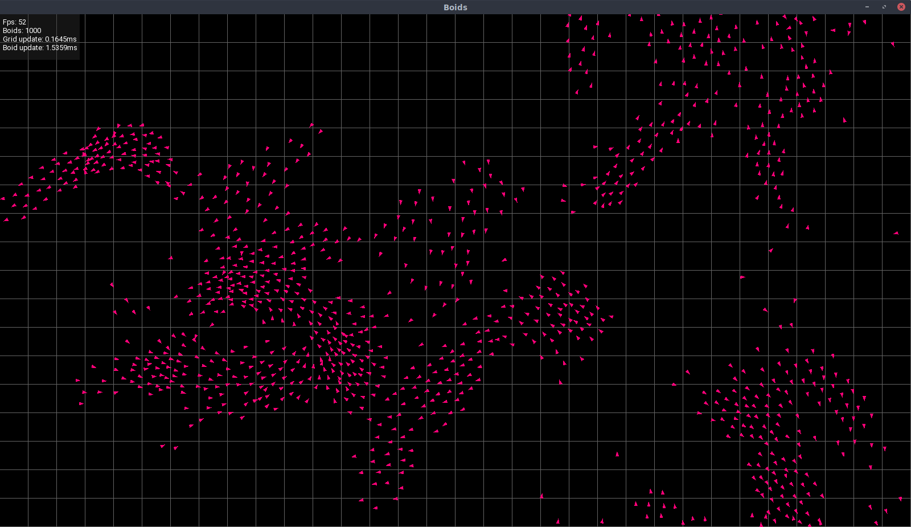

# boids

An experiment on autonomous agents based on the ["Nature of Code"'s eBook](https://natureofcode.com/book/chapter-6-autonomous-agents/).

## Controls

Use the following keys

* **ESC**: close program
* **G** : toggle grid ON/OFF
* **I** : toggle info panel ON/OFF
* **P** : toggle pause ON/OFF

## Screenshot

